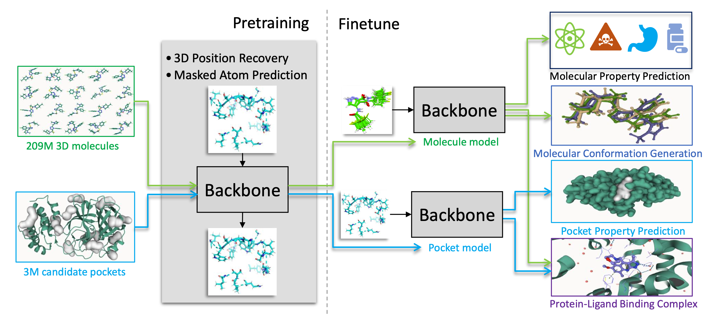

Official Repository for the Uni-Mol Series Methods
==================================================

Shortcuts
---------

- [Uni-Mol](./unimol/)
- [Uni-Mol+](./unimol_plus/)


**Note**: if you want to install or run our codes, please `cd` to subfolders first.


Uni-Mol: A Universal 3D Molecular Representation Learning Framework
-------------------------------------------------------------------

[[Paper](https://openreview.net/forum?id=6K2RM6wVqKu)], [[Uni-Mol Docking Colab](https://colab.research.google.com/github/dptech-corp/Uni-Mol/blob/main/unimol/notebooks/unimol_binding_pose_demo.ipynb)]

Authors: Gengmo Zhou, Zhifeng Gao, Qiankun Ding, Hang Zheng, Hongteng Xu, Zhewei Wei, Linfeng Zhang, Guolin Ke 

<p align="center"></p>
<p align="center"><b>Schematic illustration of the Uni-Mol framework</b></p>

Uni-Mol is a universal 3D molecular pretraining framework that offers a significant expansion of representation capacity and application scope in drug design. The framework comprises two models: a molecular pretraining model that has been trained using 209M molecular 3D conformations, 
and a pocket pretraining model that has been trained using 3M candidate protein pocket data. These two models can be used independently for different tasks and are combined for protein-ligand binding tasks. Uni-Mol has demonstrated superior performance compared to the state-of-the-art (SOTA) in 14 out of 15 molecular property prediction tasks. Moreover, Uni-Mol has achieved exceptional accuracy in 3D spatial tasks, such as protein-ligand binding pose prediction and molecular conformation generation.

Check this [subfolder](./unimol/) for more detalis.


Highly Accurate Quantum Chemical Property Prediction with Uni-Mol+
-------------------------------------------------------------------

<p align="center"></p>
<p align="center"><b>Schematic illustration of the Uni-Mol+ framework</b></p>

Uni-Mol+ is a model for quantum chemical property prediction. Firstly, given a 2D molecular graph, Uni-Mol+ generates an initial 3D conformation from inexpensive methods such as RDKit. Then, the initial conformation is iteratively optimized to its equilibrium conformation, and the optimized conformation is further used to predict the QC properties. In the PCQM4MV2 bencmark, Uni-Mol+ outperforms previous SOTA methods by a large margin.

Check this [subfolder](./unimol_plus/) for more detalis.

News
----
**Mar 16 2023**: We release Uni-Mol+, a model for quantum chemical property prediction.

**Jan 21 2023**: Uni-Mol is accepted by ICLR 2023.

**Oct 12 2022**: Provide a demo to get Uni-Mol molecular representation.

**Sep 20 2022**: Provide Uni-Mol based IFD scoring function baseline for [AIAC 2022 Competition Prediction of protein binding ability of drug molecules](http://www.aiinnovation.com.cn/#/aiaeDetail?id=560). 

**Sep 9 2022**: Provide Uni-Mol binding pose prediction (docking) demo on Colab.

**Sep 8 2022**: 

- The code and data for protein-ligand binding pose prediction are released. 
- Finetuned model weights of molecular conformation generation and protein-ligand binding pose prediction are released. 
- [Paper update](https://chemrxiv.org/engage/chemrxiv/article-details/6318b529bada388485bc8361).

**Aug 17 2022**: Pretrained models are released.

**Jul 10 2022**: Pretraining codes are released.

**Jun 10 2022**: The 3D conformation data used in Uni-Mol is released.


Citation
--------

Please kindly cite this paper if you use the data/code/model.
```
@inproceedings{
  zhou2023unimol,
  title={Uni-Mol: A Universal 3D Molecular Representation Learning Framework},
  author={Gengmo Zhou and Zhifeng Gao and Qiankun Ding and Hang Zheng and Hongteng Xu and Zhewei Wei and Linfeng Zhang and Guolin Ke},
  booktitle={The Eleventh International Conference on Learning Representations },
  year={2023},
  url={https://openreview.net/forum?id=6K2RM6wVqKu}
}
```

License
-------

This project is licensed under the terms of the MIT license. See [LICENSE](https://github.com/dptech-corp/Uni-Mol/blob/main/LICENSE) for additional details.
