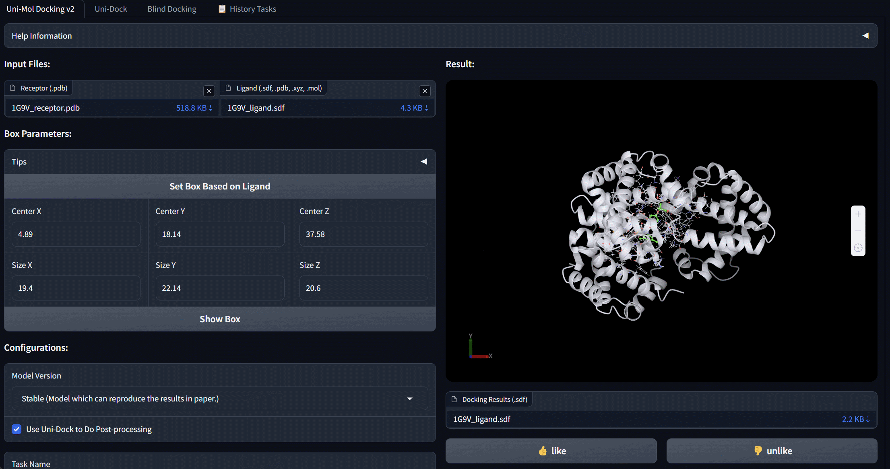
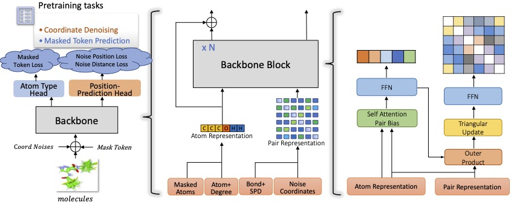

Official Repository for the Uni-Mol Series Methods
==================================================


Welcome to the official repository for the Uni-Mol series methods!

## Navigation 

| Fold | In Short | Description  |
|------------------------|---------------------------|-------------|
| [Uni-Mol](./unimol/) | Molecule Representation Framework | Uni-Mol is a universal 3D molecular representation learning framework designed for various downstreams tasks. You can use Uni-Mol in various molecule related tasks, including molecule property prediction, binding pose prediction etc. Released with [Zhou et al. 2022](https://openreview.net/forum?id=6K2RM6wVqKu) (ICLR 2023).|
| [Uni-Mol+](./unimol_plus/) | Molecule Quantumn Chemical Modeling | Un-Mol+ is design for molecule quantumn chemical property prediction, and ranks the 1st in two well-known benchmarks, OGB-LSC and OC20. You can use Uni-Mol+ in molecule geometry related tasks, such as conformation generation and optimization, quantumn property prediction. Released with [Lu et al. 2023](https://www.nature.com/articles/s41467-024-51321-w) (Nat Comm, Aug 2024). |
| [Uni-Mol Tools](./unimol_tools/) | Molecule Property Prediction Tools | Uni-Mol tools is a easy-use wrappers for automatic property prediction, representation with Uni-Mol. You can install with `pip install unimol-tools`. Released with [Gao et al. 2023](https://arxiv.org/pdf/2304.12239). (Arxiv Report, Apr 2023).|
| [Uni-Mol Docking](./unimol_docking_v2/) | Protein Ligand Docking Tools | Uni-Mol Docking achieves industry-leading performance in complex structure prediction, comparable to AlphaFold3. You can use Uni-Mol Docking for target docking with given pockets. Released with [E Alcaide et al. 2024](https://arxiv.org/pdf/2405.11769). (Arxiv Report, May 2024).|
| [Uni-Mol2](./unimol2/) | Scalable Molecular Pretraining Model | Uni-Mol2 is a flexible and scalable molecular pretraining model, with sizes ranging from 84 million to 1.1 billion parameters. This scalability allows users to select the model size that best suits a wide range of molecular tasks. Released with [Ji et al. 2024](https://arxiv.org/pdf/2406.14969). (NeurIPS 2024).|


Uni-Mol: A Universal 3D Molecular Representation Learning Framework
-------------------------------------------------------------------

[[Paper](https://openreview.net/forum?id=6K2RM6wVqKu)], [[Uni-Mol Property Prediction Service](https://bohrium.dp.tech/apps/qsar-web-new)],[[Uni-Mol Docking Service](https://bohrium.dp.tech/apps/unimoldockingv2)]

<p align="center"></p>
<p align="center"><b>Schematic illustration of the Uni-Mol framework</b></p>

Uni-Mol is a universal 3D molecular pretraining framework that offers a significant expansion of representation capacity and application scope in drug design. The framework comprises two models: a molecular pretraining model that has been trained using 209M molecular 3D conformations, 
and a pocket pretraining model that has been trained using 3M candidate protein pocket data. These two models can be used independently for different tasks and are combined for protein-ligand binding tasks. Uni-Mol has demonstrated superior performance compared to the state-of-the-art (SOTA) in 14 out of 15 molecular property prediction tasks. Moreover, Uni-Mol has achieved exceptional accuracy in 3D spatial tasks, such as protein-ligand binding pose prediction and molecular conformation generation.

Check this [subfolder](./unimol/) for more detalis.


Highly Accurate Quantum Chemical Property Prediction with Uni-Mol+
-------------------------------------------------------------------
[](https://arxiv.org/abs/2303.16982) [](https://paperswithcode.com/sota/graph-regression-on-pcqm4mv2-lsc?p=highly-accurate-quantum-chemical-property) [](https://paperswithcode.com/sota/initial-structure-to-relaxed-energy-is2re?p=highly-accurate-quantum-chemical-property)

<p align="center"></p>
<p align="center"><b>Schematic illustration of the Uni-Mol+ framework</b></p>

Uni-Mol+ is a model for quantum chemical property prediction. Firstly, given a 2D molecular graph, Uni-Mol+ generates an initial 3D conformation from inexpensive methods such as RDKit. Then, the initial conformation is iteratively optimized to its equilibrium conformation, and the optimized conformation is further used to predict the QC properties. In the PCQM4MV2 and OC20 bencmarks, Uni-Mol+ outperforms previous SOTA methods by a large margin.

Check this [subfolder](./unimol_plus/) for more detalis.

Uni-Mol tools for property prediction, representation and downstreams
--------------------------------------------------------------------
Uni-Mol tools is a easy-use wrappers for property prediction,representation and downstreams with Uni-Mol. It includes the following tools:
* molecular property prediction with Uni-Mol.
* molecular representation with Uni-Mol.
* other downstreams with Uni-Mol.

Check this [subfolder](./unimol_tools/) for more detalis.

Documentation of Uni-Mol tools is available at https://unimol.readthedocs.io/en/latest/

Uni-Mol Docking V2: Towards realistic and accurate binding pose prediction
--------------------------------------------------------------------
[](https://arxiv.org/abs/2405.11769) [](https://bohrium.dp.tech/apps/unimoldockingv2)


<p align="center"></p>
<p align="center"><b>Uni-Mol Docking V2 Bohrium App</b></p>

We update Uni-Mol Docking to Uni-Mol Docking V2, which demonstrates a remarkable improvement in performance, accurately predicting the binding poses of 77+% of ligands in the PoseBusters benchmark with an RMSD value of less than 2.0 Å, and 75+\% passing all quality checks. This represents a significant increase from the 62% achieved by the previous Uni-Mol Docking model. Notably, our Uni-Mol Docking approach generates chemically accurate predictions, circumventing issues such as chirality inversions and steric
clashes that have plagued previous ML models.

Check this [subfolder](./unimol_docking_v2/) for more detalis.

Service of Uni-Mol Docking V2 is avaiable at https://bohrium.dp.tech/apps/unimoldockingv2

Uni-Mol2: Exploring Molecular Pretraining Model at Scale
--------------------------------------------------------------------
[](https://arxiv.org/pdf/2406.14969)

<p align="center">
    
</p>

We present Uni-Mol2 , an innovative molecular pretraining model that leverages a two-track transformer to effectively integrate features at the atomic level, graph level, and geometry structure level. Along with this, we systematically investigate the scaling law within molecular pretraining models, characterizing the power-law correlations between validation loss and model size, dataset size, and computational resources. Consequently, we successfully scale Uni-Mol2 to 1.1 billion parameters through pretraining on 800 million conformations, making it the largest molecular pretraining model to date.

Check this [subfolder](./unimol2/) for more detalis.


News
----
**Sep 22 2024**: Uni-Mol2 is supported in unimol_tools, allowing you to utilize Uni-Mol2's representation and fine-tuning models in easy-use.

**Oct 10 2024**: We release Uni-Mol2 with code, demo and pretraining weights, scales from 8.4M to 1.1B.

**Sep 26 2024**: [Uni-Mol2](https://openreview.net/forum?id=64V40K2fDv) is accepted by NeurIPS 2024, our data, code, and model weights will be released soon.

**Aug 19 2024**: Uni-Mol+ is accepted by Nature Communications, reference: [Data-driven quantum chemical property prediction leveraging 3D conformations with Uni-Mol+](https://www.nature.com/articles/s41467-024-51321-w).

**Jul 1 2024**: We release [Uni-Mol2 arxiv report](https://arxiv.org/pdf/2406.14969), the largest molecular pretraining model to date with 1.1B parameters through pretraining on 800M conformations.

**May 20 2024**: We release Uni-Mol Docking V2, including data, model and weight.

**Jul 7 2023**: We update a new version of Uni-Mol+, including the model setting for OC20 and a better performance on PCQM4MV2. 

**Jun 9 2023**: We release Uni-Mol tools for property prediction, representation and downstreams.

**Mar 16 2023**: We release Uni-Mol+, a model for quantum chemical property prediction.

**Jan 21 2023**: Uni-Mol is accepted by ICLR 2023.

**Oct 12 2022**: Provide a demo to get Uni-Mol molecular representation.

**Sep 20 2022**: Provide Uni-Mol based IFD scoring function baseline for [AIAC 2022 Competition Prediction of protein binding ability of drug molecules](http://www.aiinnovation.com.cn/#/aiaeDetail?id=560). 

**Sep 9 2022**: Provide Uni-Mol binding pose prediction (docking) demo on Colab.

**Sep 8 2022**: 

- The code and data for protein-ligand binding pose prediction are released. 
- Finetuned model weights of molecular conformation generation and protein-ligand binding pose prediction are released. 
- [Paper update](https://chemrxiv.org/engage/chemrxiv/article-details/6318b529bada388485bc8361).

**Aug 17 2022**: Pretrained models are released.

**Jul 10 2022**: Pretraining codes are released.

**Jun 10 2022**: The 3D conformation data used in Uni-Mol is released.


Contact Us
--------
**1. Github issue** (recommended)   
you can open an issue on GitHub.

**2. WeChat**   
We welcome everyone to join our Uni-Mol user **WeChat group**. Scan the QR code below to join.


**3. slack**      
Overseas users can scan the QR code below to join the Uni-Mol discussion channel on Slack.


**4. E-mail**      
If you wish to have in-depth contact with the Uni-Mol development team, please send an email to unimol@dp.tech.


Citation
--------

Please kindly cite our papers if you use the data/code/model.
```
@inproceedings{
  zhou2023unimol,
  title={Uni-Mol: A Universal 3D Molecular Representation Learning Framework},
  author={Gengmo Zhou and Zhifeng Gao and Qiankun Ding and Hang Zheng and Hongteng Xu and Zhewei Wei and Linfeng Zhang and Guolin Ke},
  booktitle={The Eleventh International Conference on Learning Representations },
  year={2023},
  url={https://openreview.net/forum?id=6K2RM6wVqKu}
}
@article{lu2024data,
  title={Data-driven quantum chemical property prediction leveraging 3D conformations with Uni-Mol+},
  author={Lu, Shuqi and Gao, Zhifeng and He, Di and Zhang, Linfeng and Ke, Guolin},
  journal={Nature Communications},
  volume={15},
  number={1},
  pages={7104},
  year={2024},
  publisher={Nature Publishing Group UK London}
}
```

License
-------

This project is licensed under the terms of the MIT license. See [LICENSE](https://github.com/deepmodeling/Uni-Mol/blob/main/LICENSE) for additional details.
