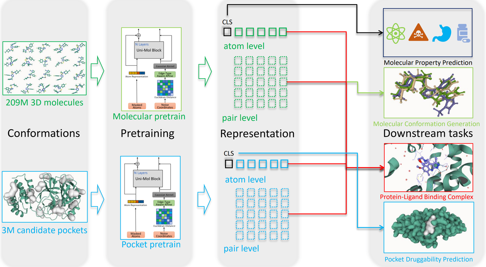

Uni-Mol: A Universal 3D Molecular Representation Learning Framework 
===================================================================

[[ChemRxiv](https://chemrxiv.org/engage/chemrxiv/article-details/6318b529bada388485bc8361)], [[Uni-Mol Docking Colab](https://colab.research.google.com/github/dptech-corp/Uni-Mol/blob/main/notebooks/unimol_binding_pose_demo.ipynb)]

Authors: Gengmo Zhou, Zhifeng Gao, Qiankun Ding, Hang Zheng, Hongteng Xu, Zhewei Wei, Linfeng Zhang, Guolin Ke 

Uni-Mol is a universal 3D molecular pretraining framework that significantly enlarges the representation ability and application scope in drug design. 

<p align="center"></p>
<p align="center"><b>Schematic illustration of the Uni-Mol framework</b></p>

Uni-Mol is composed of two models: a molecular pretraining model trained by 209M molecular 3D conformations; a pocket pretraining model trained by 3M candidate protein pocket data. The two models are used independently for separate tasks, and are combined when used in protein-ligand binding tasks. Uni-Mol outperforms SOTA in 14/15 molecular property prediction tasks. Moreover, Uni-Mol achieves superior performance in 3D spatial tasks, including protein-ligand binding pose prediction, molecular conformation generation, etc. 


News
----
**Sep 20 2022**: Provide Uni-Mol based IFD scoring function baseline for [AIAC 2022 Competition Prediction of protein binding ability of drug molecules](http://www.aiinnovation.com.cn/#/aiaeDetail?id=560). 

**Sep 9 2022**: Provide Uni-Mol binding pose prediction (docking) demo on Colab.

**Sep 8 2022**: 

- The code and data for protein-ligand binding pose prediction are released. 
- Finetuned model weights of molecular conformation generation and protein-ligand binding pose prediction are released. 
- [Paper update](https://chemrxiv.org/engage/chemrxiv/article-details/6318b529bada388485bc8361).

**Aug 17 2022**: Pretrained models are released.

**Jul 10 2022**: Pretraining codes are released.

**Jun 10 2022**: The 3D conformation data used in Uni-Mol is released.


Uni-Mol's 3D conformation data 
------------------------------

For the details of datasets, please refer to Appendix A and B in our [paper](https://chemrxiv.org/engage/chemrxiv/article-details/6318b529bada388485bc8361).

There are total 6 datasets:


| Data                     | File Size  | Update Date | Download Link                                                                     | 
|--------------------------|------------| ----------- |-----------------------------------------------------------------------------------|
| molecular pretrain       | 114.76GB   | Jun 10 2022 |https://unimol.dp.tech/data/pretrain/ligands.tar.gz                                |
| pocket pretrain          | 8.585GB    | Aug 17 2022 |https://unimol.dp.tech/data/pretrain/pockets.tar.gz                                |
| molecular property       | 3.506GB    | Jul 10 2022 |https://unimol.dp.tech/data/finetune/molecular_property_prediction.tar.gz          |
| molecular conformation   | 8.331GB    | Jul 19 2022 |https://unimol.dp.tech/data/finetune/conformation_generation.tar.gz                |
| pocket property          | 455.239MB  | Jul 19 2022 |https://unimol.dp.tech/data/finetune/pocket_property_prediction.tar.gz             |
| protein-ligand binding   | 263.27MB   | Sep 8  2022 |https://unimol.dp.tech/data/finetune/protein_ligand_binding_pose_prediction.tar.gz |


We use [LMDB](https://lmdb.readthedocs.io) to store data, you can use the following code snippets to read from the LMDB file.

```python
import lmdb
import numpy as np
import os
import pickle

def read_lmdb(lmdb_path):
    env = lmdb.open(
        lmdb_path,
        subdir=False,
        readonly=True,
        lock=False,
        readahead=False,
        meminit=False,
        max_readers=256,
    )
    txn = env.begin()
    keys = list(txn.cursor().iternext(values=False))
    for idx in keys:
        datapoint_pickled = txn.get(idx)
        data = pickle.loads(datapoint_pickled)
```
We use pickle protocol 5, so Python >= 3.8 is recommended.


Uni-Mol's pretrained model weights
----------------------------------

| Model                     | File Size  |Update Date | Download Link                                                | 
|--------------------------|------------| ------------|--------------------------------------------------------------|
| molecular pretrain       | 181MB   | Aug 17 2022 |https://unimol.dp.tech/ckp/mol_pre_no_h_220816.pt                |
| pocket pretrain          | 181MB   | Aug 17 2022 |https://unimol.dp.tech/ckp/pocket_pre_220816.pt                  |


Uni-Mol's finetuned model weights
----------------------------------

| Model                                           | File Size| Update Date| Download Link                                                     | 
|-------------------------------------------------|---------| -----------|--------------------------------------------------------------------|
| molecular conformation generation (qm9)         | 181MB   | Sep 8 2022 |https://unimol.dp.tech/ckp/conformation_generation/qm9_220908.pt    |
| molecular conformation generation (drugs)       | 181MB   | Sep 8 2022 |https://unimol.dp.tech/ckp/conformation_generation/drugs_220908.pt  |
| Protein-ligand binding pose prediction          | 415MB   | Sep 8 2022 |https://unimol.dp.tech/ckp/bindind_pose/binding_pose_220908.pt      |


Dependencies
------------
 - [Uni-Core](https://github.com/dptech-corp/Uni-Core), check its [Installation Documentation](https://github.com/dptech-corp/Uni-Core#installation).
 - rdkit==2021.09.5, install via `conda install -y -c conda-forge rdkit==2021.09.5`

To use GPUs within docker you need to [install nvidia-docker-2](https://docs.nvidia.com/datacenter/cloud-native/container-toolkit/install-guide.html#docker) first. Use the following command to pull the docker image:

```bash
docker pull dptechnology/unimol:latest-pytorch1.11.0-cuda11.3
```

Molecular Pretraining
---------------------

```bash
data_path=./example_data/molecule/ # replace to your data path
save_dir=./save/ # replace to your save path
n_gpu=8
MASTER_PORT=10086
lr=1e-4
wd=1e-4
batch_size=16
update_freq=1
masked_token_loss=1
masked_coord_loss=5
masked_dist_loss=10
x_norm_loss=0.01
delta_pair_repr_norm_loss=0.01
mask_prob=0.15
only_polar=0
noise_type="uniform"
noise=1.0
seed=1
warmup_steps=10000
max_steps=1000000

export NCCL_ASYNC_ERROR_HANDLING=1
export OMP_NUM_THREADS=1
python -m torch.distributed.launch --nproc_per_node=$n_gpu --master_port=$MASTER_PORT $(which unicore-train) $data_path  --user-dir ./unimol --train-subset train --valid-subset valid \
       --num-workers 8 --ddp-backend=c10d \
       --task unimol --loss unimol --arch unimol_base  \
       --optimizer adam --adam-betas "(0.9, 0.99)" --adam-eps 1e-6 --clip-norm 1.0 --weight-decay $wd \
       --lr-scheduler polynomial_decay --lr $lr --warmup-updates $warmup_steps --total-num-update $max_steps \
       --update-freq $update_freq --seed $seed \
       --fp16 --fp16-init-scale 4 --fp16-scale-window 256 --tensorboard-logdir $save_dir/tsb \
       --max-update $max_steps --log-interval 10 --log-format simple \
       --save-interval-updates 10000 --validate-interval-updates 10000 --keep-interval-updates 10 --no-epoch-checkpoints  \
       --masked-token-loss $masked_token_loss --masked-coord-loss $masked_coord_loss --masked-dist-loss $masked_dist_loss \
       --x-norm-loss $x_norm_loss --delta-pair-repr-norm-loss $delta_pair_repr_norm_loss \
       --mask-prob $mask_prob --noise-type $noise_type --noise $noise --batch-size $batch_size \
       --save-dir $save_dir  --only-polar $only_polar

```
The above setting is for 8 V100 GPUs, and the batch size is 128 (`n_gpu * batch_size * update_freq`). You may need to change `batch_size` or `update_freq` according to your environment. 

Pocket Pretraining
------------------

```bash
data_path=./example_data/pocket/ # replace to your data path
save_dir=./save/ # replace to your save path
n_gpu=8
MASTER_PORT=10086
dict_name="dict_coarse.txt"
lr=1e-4
wd=1e-4
batch_size=16
update_freq=1
masked_token_loss=1
masked_coord_loss=1
masked_dist_loss=1
x_norm_loss=0.01
delta_pair_repr_norm_loss=0.01
mask_prob=0.15
noise_type="uniform"
noise=1.0
seed=1
warmup_steps=10000
max_steps=1000000

export NCCL_ASYNC_ERROR_HANDLING=1
export OMP_NUM_THREADS=1
python -m torch.distributed.launch --nproc_per_node=$n_gpu --master_port=$MASTER_PORT $(which unicore-train) $data_path  --user-dir ./unimol --train-subset train --valid-subset valid \
       --num-workers 8 --ddp-backend=c10d \
       --task unimol_pocket --loss unimol --arch unimol_base  \
       --optimizer adam --adam-betas "(0.9, 0.99)" --adam-eps 1e-6 --clip-norm 1.0 --weight-decay $wd \
       --lr-scheduler polynomial_decay --lr $lr --warmup-updates $warmup_steps --total-num-update $max_steps \
       --update-freq $update_freq --seed $seed \
       --dict-name $dict_name \
       --fp16 --fp16-init-scale 4 --fp16-scale-window 256 --tensorboard-logdir $save_dir/tsb \
       --max-update $max_steps --log-interval 10 --log-format simple \
       --save-interval-updates 10000 --validate-interval-updates 10000 --keep-interval-updates 10 \
       --masked-token-loss $masked_token_loss --masked-coord-loss $masked_coord_loss --masked-dist-loss $masked_dist_loss \
       --x-norm-loss $x_norm_loss --delta-pair-repr-norm-loss $delta_pair_repr_norm_loss \
       --mask-prob $mask_prob --noise-type $noise_type --noise $noise --batch-size $batch_size \
       --save-dir $save_dir

```
The above setting is for 8 V100 GPUs, and the batch size is 128 (`n_gpu * batch_size * update_freq`). You may need to change `batch_size` or `update_freq` according to your environment. 


Molecular Property Prediction
------------------

```bash
data_path="./molecular_property_prediction"  # replace to your data path
save_dir="./save_finetune"  # replace to your save path
n_gpu=4
MASTER_PORT=10086
dict_name="dict.txt"
weight_path="./weights/checkpoint.pt"  # replace to your ckpt path
task_name="qm9dft"  # molecular property prediction task name 
task_num=3
loss_func="finetune_smooth_mae"
lr=1e-4
batch_size=32
epoch=40
dropout=0
warmup=0.06
local_batch_size=32
only_polar=0
conf_size=11
seed=0

if [ "$task_name" == "qm7dft" ] || [ "$task_name" == "qm8dft" ] || [ "$task_name" == "qm9dft" ]; then
	metric="valid_agg_mae"
elif [ "$task_name" == "esol" ] || [ "$task_name" == "freesolv" ] || [ "$task_name" == "lipo" ]; then
    metric="valid_agg_rmse"
else 
    metric="valid_agg_auc"
fi

export NCCL_ASYNC_ERROR_HANDLING=1
export OMP_NUM_THREADS=1
update_freq=`expr $batch_size / $local_batch_size`
python -m torch.distributed.launch --nproc_per_node=$n_gpu --master_port=$MASTER_PORT $(which unicore-train) $data_path --task-name $task_name --user-dir ./unimol --train-subset train --valid-subset valid \
       --conf-size $conf_size \
       --num-workers 8 --ddp-backend=c10d \
       --dict-name $dict_name \
       --task mol_finetune --loss $loss_func --arch unimol_base  \
       --classification-head-name $task_name --num-classes $task_num \
       --optimizer adam --adam-betas "(0.9, 0.99)" --adam-eps 1e-6 --clip-norm 1.0 \
       --lr-scheduler polynomial_decay --lr $lr --warmup-ratio $warmup --max-epoch $epoch --batch-size $local_batch_size --pooler-dropout $dropout\
       --update-freq $update_freq --seed $seed \
       --fp16 --fp16-init-scale 4 --fp16-scale-window 256 \
       --log-interval 100 --log-format simple \
       --validate-interval 1 \
       --finetune-from-model $weight_path \
       --best-checkpoint-metric $metric --patience 20 \
       --save-dir $save_dir --only-polar $only_polar \
       --reg

# --reg, for regression task
# --maximize-best-checkpoint-metric, for classification task

```

To speed up finetune, we set `n_gpu=4` for QM9, MUV, PCBA and HIV, and `n_gpu=1` for others, and the batch size is `n_gpu * local_batch_size * update_freq`.
For regression task, we set `--reg`. 
For classification task, we set `--maximize-best-checkpoint-metric`.

Each task will be run by 3 different seeds. We choose the checkpoint with the best metric on validation set and report the mean and standard deviation of the three results on the test set.

For the selection of `task_num` and other hyperparameters, please refer to the following table:

- Classification

|Dataset      | BBBP | BACE | ClinTox | Tox21 | ToxCast | SIDER | HIV | PCBA | MUV |
|--------|----|----|----|----|----|-----|-----|----|-----|       
| task_num |  2 | 2 | 2 | 12 | 617 | 27 | 2 | 128 | 17 |
| lr         |  4e-4 | 1e-4 | 5e-5 | 1e-4 | 1e-4 | 5e-4 | 5e-5 | 1e-4 | 2e-5 |
| batch_size |  128 | 64 | 256 | 128 | 64 | 32 | 256 | 128 | 128 |
| epoch      |  40 | 60 | 100 | 80 | 80 | 80 | 5 | 20 | 40 |
| dropout    |  0 | 0.1 | 0.5 | 0.1 | 0.1 | 0 | 0.2 | 0.1 | 0 |
| warmup     |  0.06 | 0.06 | 0.1 | 0.06 | 0.06 | 0.1 | 0.1 | 0.06 | 0 |

For BBBP, BACE and HIV, we set `loss_func=finetune_cross_entropy`.
For ClinTox, Tox21, ToxCast, SIDER, HIV, PCBA and MUV, we set `loss_func=multi_task_BCE`.

- Regression

| Dataset | ESOL | FreeSolv | Lipo | QM7 | QM8 | QM9 |
|----- | ---- | ---- | ---- | ---- | --- | --- |
| task_num | 1 | 1 |  1 | 1  | 12 | 3 |
| lr         | 5e-4 | 8e-5 |  1e-4 | 3e-4  | 1e-4 | 1e-4 |
| batch_size | 256 | 64 |  32 | 32  | 32 | 128 |
| epoch      | 100 | 60 |  80 | 100  | 40 | 40 |
| dropout    | 0.2 | 0.2 |  0.1 | 0  | 0 | 0 |
| warmup     | 0.06 | 0.1 | 0.06 | 0.06  | 0.06 | 0.06 |


For ESOL, FreeSolv and Lipo, we set `loss_func=finetune_mse`.
For QM7, QM8 and QM9, we set `loss_func=finetune_smooth_mae`.

**NOTE**: Our first version of the molecular pretraining ran with **all hydrogen** pretrained model, and above hyper-parameters are also for **all hydrogen** pretrained model. You can download the [all hydrogen model parameter](https://unimol.dp.tech/ckp/mol_pre_all_h_220816.pt) here, and use it with `only_polar=-1` to reproduce our results. The performance of pretraining model with **no hydrogen** is very close to the **all hydrogen** one in molecular property prediction. We will update the hyperparameters for the no hydrogen version later.

**NOTE**: For reproduce, you can do the validation on test set while training, with `--valid-subset valid` changing to `--valid-subset valid,test`. The model selection is still based on the performance of the valid set. It is controlled by `--best-checkpoint-metric $metric`.

**NOTE**: You"d better align the `only_polar` parameter in pretraining and finetuning: `-1` for all hydrogen, `0` for no hydrogen, `1` for polar hydrogen.


Molecular conformation generation
------------------

1. Finetune Uni-Mol pretrained model on the training set of the conformation generation task: 

```bash
data_path="./conformation_generation"  # replace to your data path
save_dir="./save_confgen"  # replace to your save path
n_gpu=1
MASTER_PORT=10086
dict_name="dict.txt"
weight_path="./weights/checkpoint.pt"  # replace to your ckpt path
task_name="qm9"  # or "drugs", conformation generation task name, as a part of complete data path
recycles=4
coord_loss=1
distance_loss=1
beta=4.0
smooth=0.1
topN=20
lr=2e-5
batch_size=128
epoch=50
warmup=0.06
update_freq=1

export NCCL_ASYNC_ERROR_HANDLING=1
export OMP_NUM_THREADS=1
python -m torch.distributed.launch --nproc_per_node=$n_gpu --master_port=$MASTER_PORT $(which unicore-train) $data_path --task-name $task_name --user-dir ./unimol --train-subset train --valid-subset valid \
       --num-workers 8 --ddp-backend=c10d \
       --task mol_confG --loss mol_confG --arch mol_confG  \
       --optimizer adam --adam-betas "(0.9, 0.99)" --adam-eps 1e-6 --clip-norm 1.0 \
       --lr-scheduler polynomial_decay --lr $lr --warmup-ratio $warmup --max-epoch $epoch --batch-size $batch_size \
       --update-freq $update_freq --seed 1 \
       --fp16 --fp16-init-scale 4 --fp16-scale-window 256 \
       --log-interval 100 --log-format simple --tensorboard-logdir $save_dir/tsb \
       --validate-interval 1 --keep-last-epochs 10 \
       --keep-interval-updates 10 --best-checkpoint-metric loss  --patience 50 --all-gather-list-size 102400 \
       --finetune-mol-model $weight_path --save-dir $save_dir \
       --coord-loss $coord_loss --distance-loss $distance_loss \
       --num-recycles $recycles --beta $beta --smooth $smooth --topN $topN \
       --find-unused-parameters

```

2. Generate initial RDKit conformations for inference: 

- Run this command, 

```bash
mode="gen_data"
nthreads=20  # Num of threads
reference_file="./conformation_generation/qm9/test_data_200.pkl"  # Your reference file dir
output_path="./conformation_generation/qm9"  # Generated initial data dir

python ./unimol/utils/conf_gen_cal_metrics.py --mode $mode --nthreads $nthreads --reference-file $reference_file --output-dir $output_dir

```

3. Inference on the generated RDKit initial conformations:

```bash
data_path="./conformation_generation"  # replace to your data path
results_path="./infer_confgen"  # replace to your results path
weight_path="./save_confgen/checkpoint_best.pt"  # replace to your ckpt path
batch_size=128
task_name="qm9"  # or "drugs", conformation generation task name 
recycles=4

python ./unimol/infer.py --user-dir ./unimol $data_path --task-name $task_name --valid-subset test \
       --results-path $results_path \
       --num-workers 8 --ddp-backend=c10d --batch-size $batch_size \
       --task mol_confG --loss mol_confG --arch mol_confG \
       --num-recycles $recycles \
       --path $weight_path \
       --fp16 --fp16-init-scale 4 --fp16-scale-window 256 \
       --log-interval 50 --log-format simple 
```
- For reproduce, you can also use the finetuned checkpoint we released in the table above to infer.

- **NOTE**: Currently, the inference is only supported to run on a single GPU. You can add `CUDA_VISIBLE_DEVICES="0"` before the command.

4. Calculate metrics on the results of inference: 

- Run this command
```bash
mode="cal_metrics"
threshold=0.5  # Threshold for cal metrics, 0.5 for qm9, 1.25 for drugs
nthreads=20  # Num of threads
predict_file="./infer_confgen/save_confgen_test.out.pkl"  # Your inference file dir
reference_file="./conformation_generation/qm9/test_data_200.pkl"  # Your reference file dir

python ./unimol/utils/conf_gen_cal_metrics.py --mode $mode --threshold $threshold --nthreads $nthreads --predict-file $predict_file --reference-file $reference_file
```


Pocket Property Prediction
------------------

```bash
data_path="./pocket_property_prediction"  # replace to your data path
save_dir="./save_finetune"  # replace to your save path
n_gpu=1
MASTER_PORT=10086
dict_name="dict_coarse.txt"
weight_path="./weights/checkpoint.pt"
task_name="druggability"  # or "nrdld", pocket property prediction dataset folder name 
lr=3e-4
batch_size=32
epoch=20
dropout=0
warmup=0.1
local_batch_size=32
seed=1

if [ "$task_name" == "druggability" ]; then
       metric="valid_rmse"
       loss_func="finetune_mse_pocket"
       task_num=1
       fpocket_score="Druggability Score"  # choose in ["Score", "Druggability Score", "Total SASA", "Hydrophobicity score"]
else
       metric="loss"
       loss_func="finetune_cross_entropy_pocket"
       task_num=2
fi

export NCCL_ASYNC_ERROR_HANDLING=1
export OMP_NUM_THREADS=1
update_freq=`expr $batch_size / $local_batch_size`
python -m torch.distributed.launch --nproc_per_node=$n_gpu --master_port=$MASTER_PORT $(which unicore-train) $data_path --task-name $task_name --user-dir ./unimol --train-subset train --valid-subset valid \
       --num-workers 8 --ddp-backend=c10d \
       --dict-name $dict_name \
       --task pocket_finetune --loss $loss_func --arch unimol_base  \
       --classification-head-name $task_name --num-classes $task_num \
       --optimizer adam --adam-betas "(0.9, 0.99)" --adam-eps 1e-6 --clip-norm 1.0 \
       --lr-scheduler polynomial_decay --lr $lr --warmup-ratio $warmup --max-epoch $epoch --batch-size $local_batch_size --pooler-dropout $dropout \
       --update-freq $update_freq --seed $seed \
       --fp16 --fp16-init-scale 4 --fp16-scale-window 256 \
       --log-interval 100 --log-format simple \
       --validate-interval 1 --finetune-from-model $weight_path \
       --best-checkpoint-metric $metric --patience 2000 \
       --save-dir $save_dir --remove-hydrogen --fpocket-score "$fpocket_score"

# --maximize-best-checkpoint-metric, for classification task

```

The batch size is `n_gpu * local_batch_size * update_freq`.
For classification task, we set `--maximize-best-checkpoint-metric`.

We choose the checkpoint with the best metric on validation set. It is controlled by `--best-checkpoint-metric $metric`. Specifically, for NRDLD, since it has no validation set, we choose the checkpoint of the last epoch. For Fpocket Scores, we report the mean and standard deviation of the results for three random seeds.

**NOTE**: For reproduce, you can do the validation on test set while training, with `--valid-subset valid` changing to `--valid-subset valid,test`.


Protein-ligand Binding Pose Prediction
------------------

1. Finetune Uni-Mol pretrained model on the training set: 

```bash
data_path="./protein_ligand_binding_pose_prediction"  # replace to your data path
save_dir="./save_pose"  # replace to your save path
n_gpu=4
MASTER_PORT=10086
finetune_mol_model="./weights/mol_checkpoint.pt"
finetune_pocket_model="./weights/pocket_checkpoint.pt"
lr=3e-4
batch_size=8
epoch=50
dropout=0.2
warmup=0.06
update_freq=1
dist_threshold=8.0
recycling=3

export NCCL_ASYNC_ERROR_HANDLING=1
export OMP_NUM_THREADS=1
python -m torch.distributed.launch --nproc_per_node=$n_gpu --master_port=$MASTER_PORT $(which unicore-train) $data_path --user-dir ./unimol --train-subset train --valid-subset valid \
       --num-workers 8 --ddp-backend=c10d \
       --task docking_pose --loss docking_pose --arch docking_pose  \
       --optimizer adam --adam-betas "(0.9, 0.99)" --adam-eps 1e-6 --clip-norm 1.0 \
       --lr-scheduler polynomial_decay --lr $lr --warmup-ratio $warmup --max-epoch $epoch --batch-size $batch_size \
       --mol-pooler-dropout $dropout --pocket-pooler-dropout $dropout \
       --fp16 --fp16-init-scale 4 --fp16-scale-window 256 --update-freq $update_freq --seed 1 \
       --tensorboard-logdir $save_dir/tsb \
       --log-interval 100 --log-format simple \
       --validate-interval 1 --keep-last-epochs 10 \
       --best-checkpoint-metric valid_loss  --patience 2000 --all-gather-list-size 2048000 \
       --finetune-mol-model $finetune_mol_model \
       --finetune-pocket-model $finetune_pocket_model \
       --dist-threshold $dist_threshold --recycling $recycling \
       --save-dir $save_dir \
       --find-unused-parameters

```

2. Inference on the test set:

```bash
data_path="./protein_ligand_binding_pose_prediction"  # replace to your data path
results_path="./infer_pose"  # replace to your results path
weight_path="./save_pose/checkpoint.pt"
batch_size=8
dist_threshold=8.0
recycling=3

python ./unimol/infer.py --user-dir ./unimol $data_path --valid-subset test \
       --results-path $results_path \
       --num-workers 8 --ddp-backend=c10d --batch-size $batch_size \
       --task docking_pose --loss docking_pose --arch docking_pose \
       --path $weight_path \
       --fp16 --fp16-init-scale 4 --fp16-scale-window 256 \
       --dist-threshold $dist_threshold --recycling $recycling \
       --log-interval 50 --log-format simple
```
- For reproduce, you can also use the finetuned checkpoint we released in the table above to infer.

- **NOTE**: Currently, the inference is only supported to run on a single GPU. You can add `CUDA_VISIBLE_DEVICES="0"` before the command.

4. Docking and cal metrics: 

- Run this command
```bash
nthreads=20  # Num of threads
predict_file="./infer_pose/save_pose_test.out.pkl"  # Your inference file dir
reference_file="./protein_ligand_binding_pose_prediction/test.lmdb"  # Your reference file dir
output_path="./protein_ligand_binding_pose_prediction"  # Docking results path

python ./unimol/utils/docking.py --nthreads $nthreads --predict-file $predict_file --reference-file $reference_file --output-path $output_path
```

AIAC 2022 Competition Prediction of protein binding ability of drug molecules
------------------
- Competition Link: [AIAC 2022 Competition Prediction of protein binding ability of drug molecules](http://www.aiinnovation.com.cn/#/aiaeDetail?id=560). 
- Entry and final submission deadline: 2022-09-26
- Run this command
```bash
git checkout ifd_demo    
### download data from competition website and decompress it to ./examples/ifd_docking
sh train_ifd.sh
sh infer_ifd.sh
cd ./examples/ifd_scoring && python generate_submit.py 
```

Citation
--------

Please kindly cite this paper if you use the data/code/model.
```
@article{zhou2022uni,
  title={Uni-Mol: A Universal 3D Molecular Representation Learning Framework},
  author={Zhou, Gengmo and Gao, Zhifeng and Ding, Qiankun and Zheng, Hang and Xu, Hongteng and Wei, Zhewei and Zhang, Linfeng and Ke, Guolin},
  journal={ChemRxiv},
  publisher={Cambridge Open Engage},
  DOI={10.26434/chemrxiv-2022-jjm0j-v2},
  year={2022}
}
```

License
-------

This project is licensed under the terms of the MIT license. See [LICENSE](https://github.com/dptech-corp/Uni-Mol/blob/main/LICENSE) for additional details.
