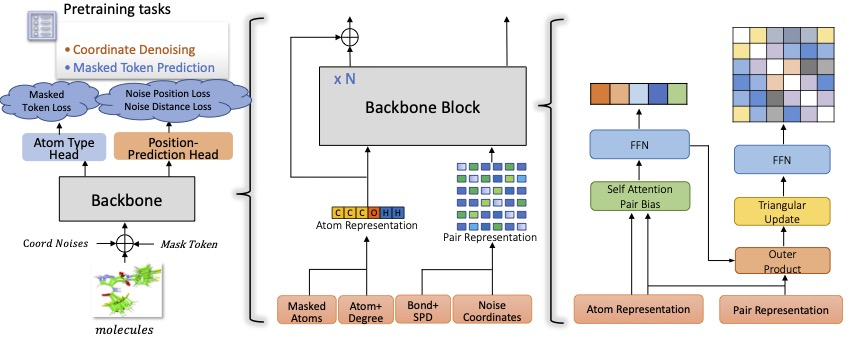

Uni-Mol2: Exploring Molecular Pretraining Model at Scale
==================================================================

<p align="center">
    
</p>

We present Uni-Mol2 , an innovative
molecular pretraining model that leverages a two-track transformer to effectively
integrate features at the atomic level, graph level, and geometry structure level.
Along with this, we systematically investigate the scaling law within molecular
pretraining models, characterizing the power-law correlations between validation
loss and model size, dataset size, and computational resources. Consequently,
we successfully scale Uni-Mol2 to 1.1 billion parameters through pretraining on
800 million conformations, making it the largest molecular pretraining model to
date.


Dependencies
------------
 - [Uni-Core](https://github.com/dptech-corp/Uni-Core) with pytorch > 2.0.0, check its [Installation Documentation](https://github.com/dptech-corp/Uni-Core#installation).
 - rdkit==2022.09.5, install via `pip install rdkit==2022.09.5`


Model Zoo
------------


| Model    | Layers | Embedding dim | Attention heads | Pair embedding dim | Pair hidden dim | FFN embedding dim | Learning rate | Batch size |
|-----------|--------|---------------|-----------------|--------------------|-----------------|-------------------|---------------|-----------|
|  [**UniMol2-84M**](https://huggingface.co/dptech/Uni-Mol2/blob/main/modelzoo/84M/checkpoint.pt)     | 12     | 768           | 48              | 512                | 64              | 768               | 1e-4         | 1024      |
| [**UniMol2-164M**](https://huggingface.co/dptech/Uni-Mol2/blob/main/modelzoo/164M/checkpoint.pt)    | 24     | 768           | 48              | 512                | 64              | 768               | 1e-4         | 1024      |
| [**UniMol2-310M**](https://huggingface.co/dptech/Uni-Mol2/blob/main/modelzoo/310M/checkpoint.pt)    | 32     | 1024          | 64              | 512                | 64              | 1024              | 1e-4         | 1024      |
| [**UniMol2-570M**](https://huggingface.co/dptech/Uni-Mol2/blob/main/modelzoo/570M/checkpoint.pt)    | 32     | 1536          | 96              | 512                | 64              | 1536              | 1e-4         | 1024      |
| [**UniMol2-1.1B**](https://huggingface.co/dptech/Uni-Mol2/blob/main/modelzoo/1.1B/checkpoint.pt)    | 64     | 1536          | 96              | 512                | 64              | 1536              | 1e-4         | 1024      |


Downstream Finetune
------------

```
task_name="qm9dft_v2"  # molecular property prediction task name 
task_num=3
weight_name="checkpoint.pt"
loss_func="finetune_smooth_mae"
arch_name=84M
arch=unimol2_$arch_name


data_path='Your Data Path"
weight_path="Your Checkpoint Path"
weight_path=$weight_path/$weight_name

drop_feat_prob=1.0
use_2d_pos=0.0
ema_decay=0.999

lr=1e-4
batch_size=32
epoch=40
dropout=0
warmup=0.06
local_batch_size=16
seed=0
conf_size=11

n_gpu=1
reg_task="--reg"
metric="valid_agg_mae"
save_dir="./save_dir"

update_freq=`expr $batch_size / $local_batch_size`
global_batch_size=`expr $local_batch_size \* $n_gpu \* $update_freq`

torchrun --standalone --nnodes=1 --nproc_per_node=$n_gpu \
    $(which unicore-train) $data_path \
    --task-name $task_name --user-dir ./unimol2 --train-subset train --valid-subset valid,test \
    --conf-size $conf_size \
    --num-workers 8 --ddp-backend=c10d \
    --task mol_finetune --loss $loss_func --arch $arch  \
    --classification-head-name $task_name --num-classes $task_num \
    --optimizer adam --adam-betas "(0.9, 0.99)" --adam-eps 1e-6 --clip-norm 1.0 \
    --lr-scheduler polynomial_decay --lr $lr --warmup-ratio $warmup --max-epoch $epoch \
    --batch-size $local_batch_size --pooler-dropout $dropout\
    --update-freq $update_freq --seed $seed \
    --fp16 --fp16-init-scale 4 --fp16-scale-window 256 --no-save \
    --log-interval 100 --log-format simple \
    --validate-interval 1 \
    --finetune-from-model $weight_path \
    --best-checkpoint-metric $metric --patience 20 \
    --save-dir $save_dir \
    --drop-feat-prob ${drop_feat_prob} \
    --use-2d-pos-prob ${use_2d_pos} \
    $more_args \
    $reg_task \
    --find-unused-parameters
```


Citation
------------

Please kindly cite this paper if you use the data/code/model.
```
@article{ji2024uni,
  title={Uni-Mol2: Exploring Molecular Pretraining Model at Scale},
  author={Xiaohong, Ji and Zhen, Wang and Zhifeng, Gao and Hang, Zheng and Linfeng, Zhang and Guolin, Ke and Weinan, E},
  journal={arXiv preprint arXiv:2406.14969},
  year={2024}
}

```

License
-------

This project is licensed under the terms of the MIT license. See [LICENSE](https://github.com/deepmodeling/Uni-Mol/blob/main/LICENSE) for additional details.
