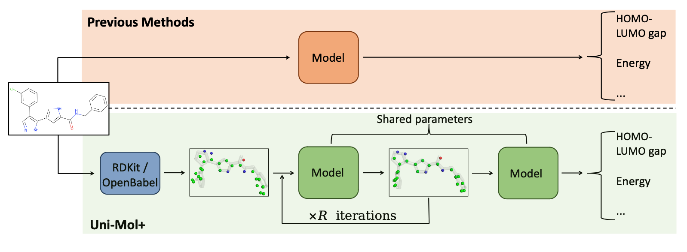

Highly Accurate Quantum Chemical Property Prediction with Uni-Mol+
==================================================================
[Paper](./paper/unimol_plus_preprint.pdf)

<p align="center"></p>
<p align="center"><b>Schematic illustration of the Uni-Mol+ framework</b></p>

Uni-Mol+ is a model for quantum chemical property prediction. Firstly, given a 2D molecular graph, Uni-Mol+ generates an initial 3D conformation from inexpensive methods such as RDKit. Then, the initial conformation is iteratively optimized to its equilibrium conformation, and the optimized conformation is further used to predict the QC properties.

In the [PCQM4MV2](https://ogb.stanford.edu/docs/lsc/leaderboards/#pcqm4mv2) bencmark, Uni-Mol+ outperforms previous SOTA methods by a large margin.

| Model Settings   | # Layers   | # Param.    | Validation MAE   | Model Checkpoint | 
|------------------|------------| ----------- |------------------|------------------|
| Uni-Mol+         |     12     |   52.4 M    | 0.0708           | [link](https://github.com/dptech-corp/Uni-Mol/releases/download/v0.1/unimol_plus_base.pt)          |
| Uni-Mol+ Large   |     18     |   77 M      | 0.0701           | [link](https://github.com/dptech-corp/Uni-Mol/releases/download/v0.1/unimol_plus_large.pt)         |


Dependencies
------------
 - [Uni-Core](https://github.com/dptech-corp/Uni-Core), check its [Installation Documentation](https://github.com/dptech-corp/Uni-Core#installation).
 - rdkit==2022.09.3, install via `pip install rdkit==2022.09.3`


Data Preparation
----------------

First, download the data:

```bash
cd scripts
bash download.sh
```

Second, covert the 3D SDF (training set only) to lmdb file:

```bash
python get_label3d_lmdb.py
```

Finally, generate the training, validation and test datasets:

```bash
python get_3d_lmdb.py train
python get_3d_lmdb.py valid
python get_3d_lmdb.py test-dev
python get_3d_lmdb.py test-challenge
```

Inference
---------
```bash
export data_path="your_data_path"
export results_path="your_result_path"
export weight_path="your_ckp_path"
export arch="unimol_plus_large" # or "unimol_plus_base" if you use 12-layer model
bash inference.sh test-dev # or other splits
```

Training
--------
```bash
data_path="your_data_path"
save_dir="your_save_path"
lr=2e-4
batch_size=128 # per gpu batch size 128, we default use 8 GPUs
export arch="unimol_plus_large" # or "unimol_plus_base" if you use 12-layer model
bash train_pcq.sh $data_path $save_dir $lr $batch_size
```


License
-------

This project is licensed under the terms of the MIT license. See [LICENSE](https://github.com/dptech-corp/Uni-Mol/blob/main/LICENSE) for additional details.
